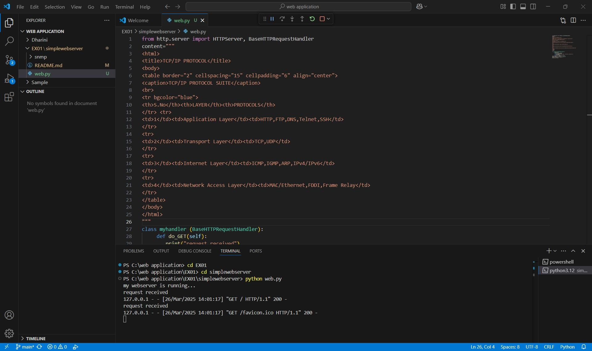
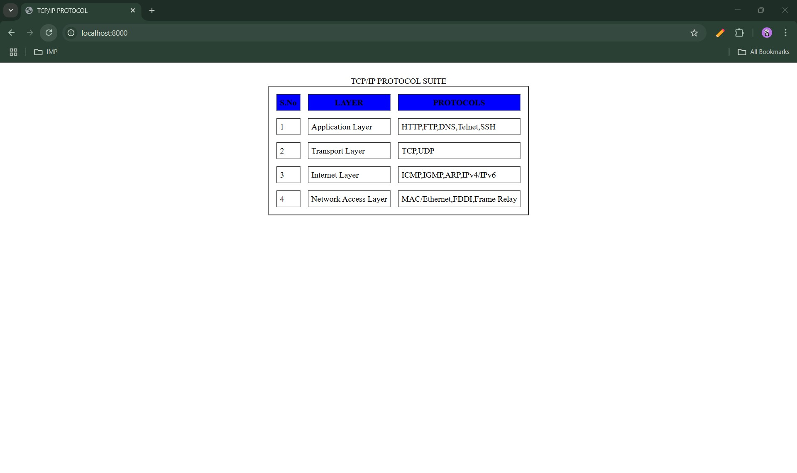

# EX01 Developing a Simple Webserver
## Date:26.03.2025

## AIM:
To develop a simple webserver to serve html pages and display the list of protocols in TCP/IP Protocol Suite.

## DESIGN STEPS:
### Step 1: 
HTML content creation.

### Step 2:
Design of webserver workflow.

### Step 3:
Implementation using Python code.

### Step 4:
Serving the HTML pages.

### Step 5:
Testing the webserver.

## PROGRAM:

<html>

<title>TCP/IP PROTOCOL</title>

<body>

<table border="2" cellspacing="15" cellpadding="6" align="center">

<caption>TCP/IP PROTOCOL SUITE</caption>

 

<tr bgcolor="blue">

<th>S.No</th><th>LAYER</th><th>PROTOCOLS</th>

</tr> <tr>

<td>1</td><td>Application Layer</td><td>HTTP,FTP,DNS,Telnet,SSH</td>

</tr>

<tr>

<td>2</td><td>Transport Layer</td><td>TCP,UDP</td>

</tr>

<tr>

<td>3</td><td>Internet Layer</td><td>ICMP,IGMP,ARP,IPv4/IPv6</td>

</tr>

<tr>

<td>4</td><td>Network Access Layer</td><td>MAC/Ethernet,FDDI,Frame Relay</td>

</tr>

</table>

</body>

</html>

## OUTPUT:

## RESULT:
The program for implementing simple webserver is executed successfully.
